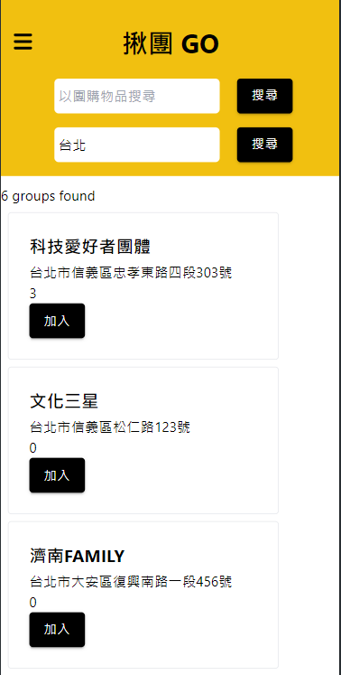
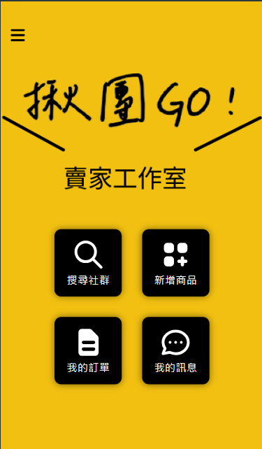

# 揪團GO

> frontend: React, Tailwind

> backend: Flask, Python

## Project Overview
[🔗 展示影片連結](https://drive.google.com/file/d/1UY1fXgROTleYcxQgEYIOsI1HQPmhJIE-/view)

「揪團 GO」是一個協助團購流程更為簡潔便利的平台，買家可以透過 LINE Bot 或官網來加入群組並團購商品，賣家可以透過官網來建立群組並加入商品，由系統幫忙統計各商品的訂購數量，解決了原本使用 LINE 群組，常被各種對話洗版、也難以正確統計團購總數量的問題。


## To set up database
Create new database in PostgreSQL and restore database from ```GO_release4.sql```.

Go to backend, create ```db_password.txt``` and write your password in the file.

Change database name in ```app.py```
```
dbname = <your database name>
```

## To start the Website


### Go to frontend

```
cd frontend
```
install dependencies
```
npm i
```
start the application

```
npm start
```

the website runs on http://localhost:3000/

---

### Go to backend

```
cd backend
```
create venv

```
py -m venv venv   # for Windows
python3 -m venv venv   # for macOS
```

activate venv

```
.\venv\Scripts\activate.ps1   # for Windows
source venv/bin/activate   # for macOS
```
install requirements

```
pip install -r requirements.txt
```

run flask

```
python app.py
```

and the server would runs on port http://localhost:5000/

<i>The CORS policy is dealt by using vite proxy</i>

## Example
進入「揪團 GO」平台時，一開始是登入畫面。


按下註冊按鈕，在註冊畫面進行註冊。


接下來登入後會自動導向至 SearchFood Page，即可開始透過搜尋團購物品或地點來探索「揪團 GO」平台。


若您希望成為賣家，可以點擊左方三條橫線的選單列進入「建立團購群」或「賣家工作室」畫面，開始使用賣家功能。


以下提供兩組帳密讓大家測試功能。

| Role | Account | Password |
| --- | --- | --- |
| Buyer | Buffett@gmail.com | Gorge0312 |
| Seller | seller1@gmail.com.tw | og92kk11 |

## To start the LINE Bot