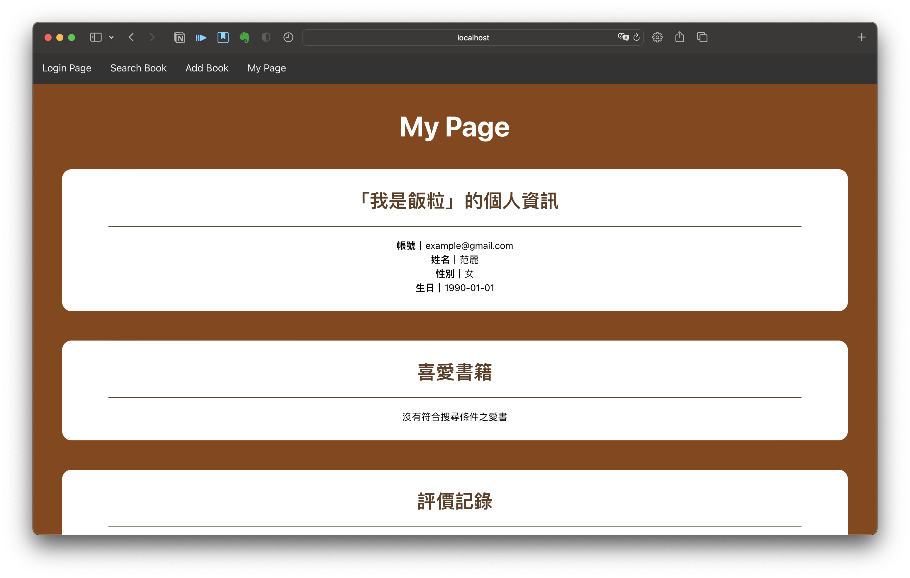
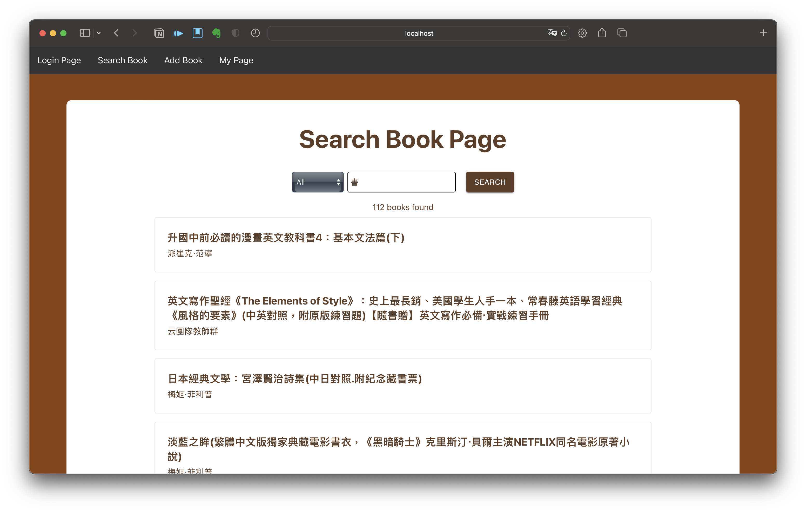

# 揪團GO

> frontend: React, Tailwind

> backend: Flask, Python

## Project Overview
[🔗 展示影片連結](https://www.youtube.com/watch?v=QPGB96r7pdg)

「好書 sharing」是一個提升閱讀體驗及樂趣的平台，用戶可以在此分享最真實的閱讀感受、推薦自己喜愛的書籍及追蹤與其品味相似同好，降低尋找好書的搜尋成本。對於熱愛閱讀的人而言，這將是一個最真實、實用的交流空間。


## To set up database
Create new database in PostgreSQL and restore database from ```book_sharing_db.sql```.

Go to backend, create ```db_password.txt``` and write your password in the file.

Change database name in ```app.py```
```
dbname = <your database name>
```

## To start the Website


### Go to frontend

```
cd frontend
```
install dependencies
```
npm i
```
start the application

```
npm start
```

the website runs on http://localhost:3000/

---

### Go to backend

```
cd backend
```
create venv

```
py -m venv venv   # for Windows
python3 -m venv venv   # for macOS
```

activate venv

```
.\venv\Scripts\activate.ps1   # for Windows
source venv/bin/activate   # for macOS
```
install requirements

```
pip install -r requirements.txt
```

run flask

```
python app.py
```

and the server would runs on port http://127.0.0.1:5000/

<i>The CORS policy is dealt by using vite proxy</i>

## Example
進入「好書 Sharing」平台時，一開始是登入畫面。

按下註冊按鈕，在註冊畫面進行註冊。

接下來登入後會自動導向至 My Page，即可開始探索「好書 Sharing」平台。

以「搜尋書籍」的功能為例，可以在上方的選單列進入 Search Book 畫面，開始找書。


以下提供兩組帳密讓大家測試功能。

| Role | Account | Password |
| --- | --- | --- |
| User | xjmCgwsEqlQpGoBvGVVk@gmail.com | s1Qu4OcWvy |
| Admin | tvgRaQkjYTjKTelNwCgU@gmail.com | 35qzHeSUgf |
